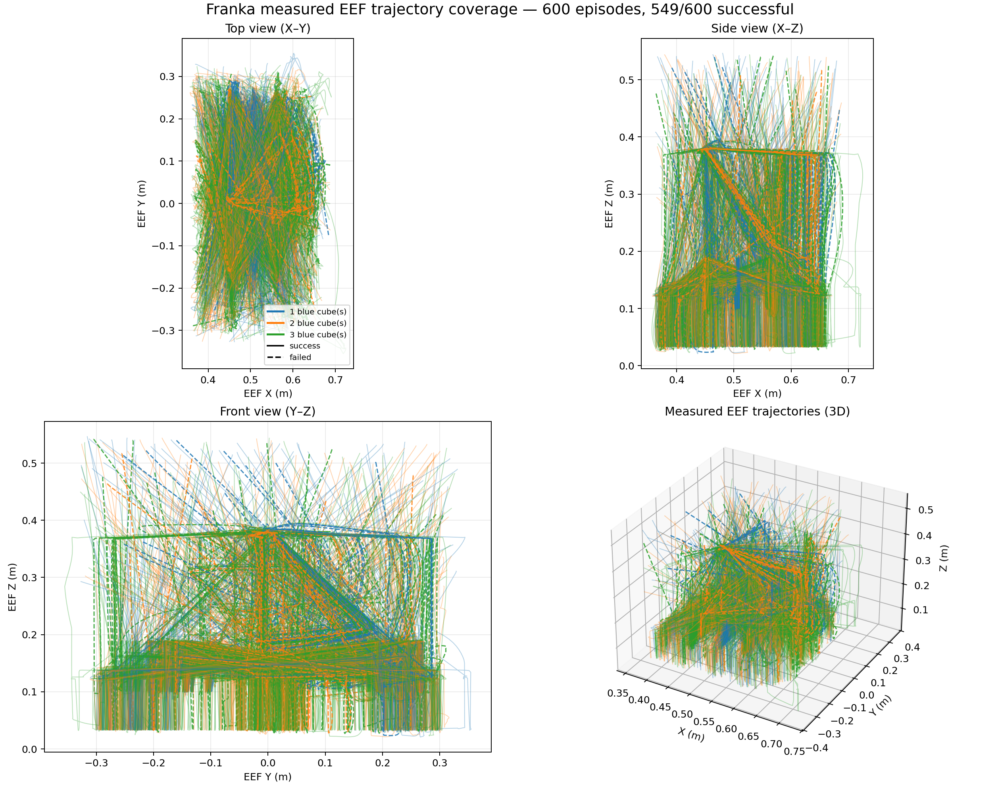
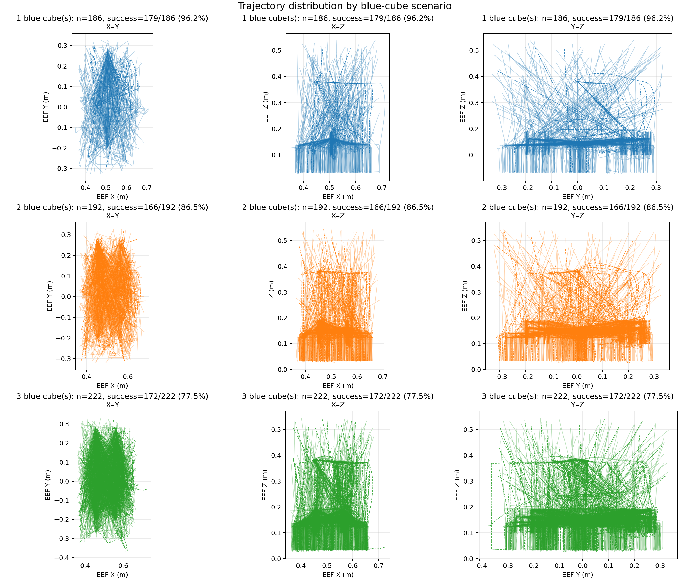
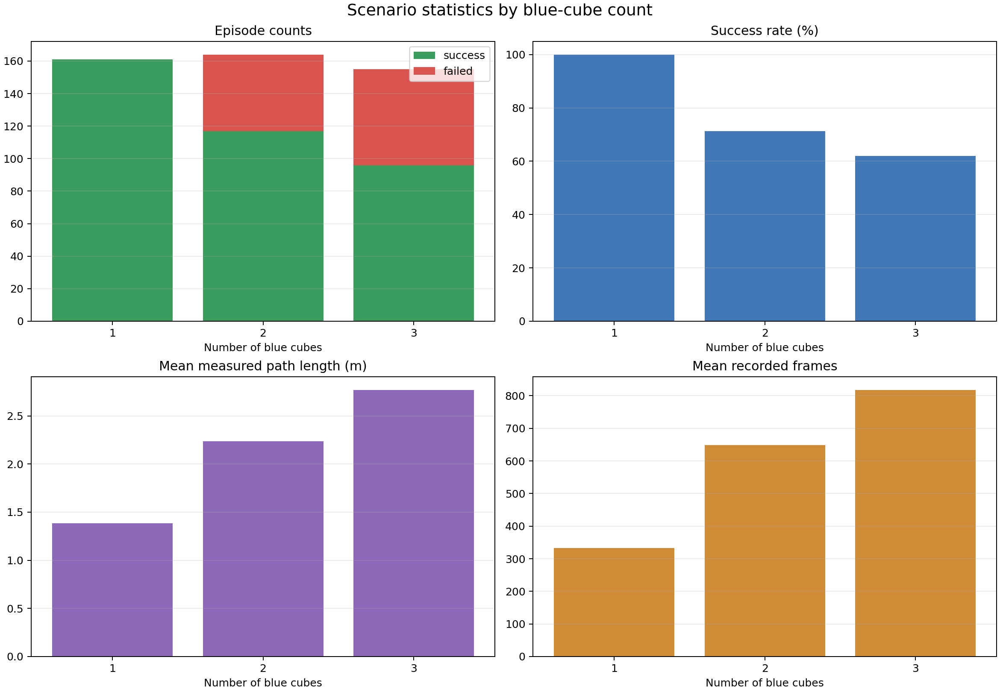
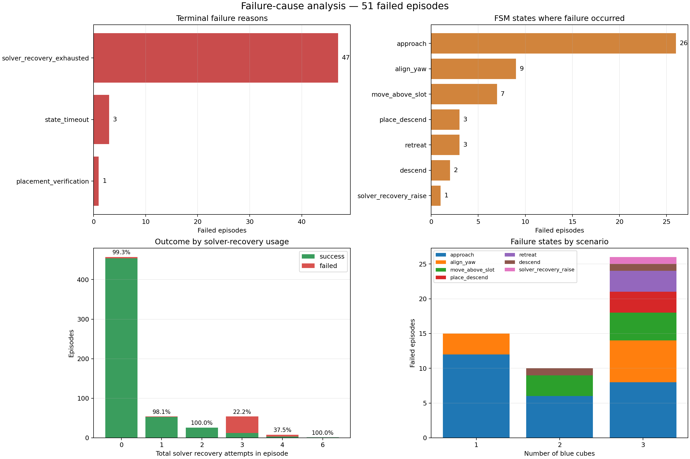
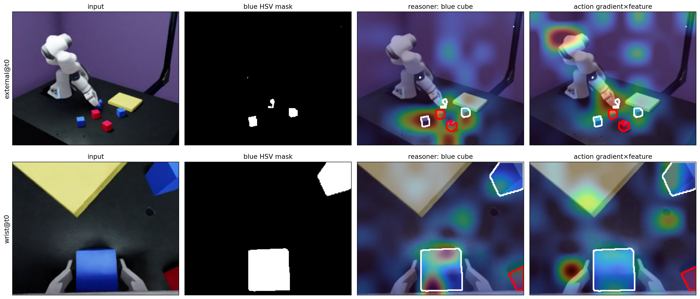
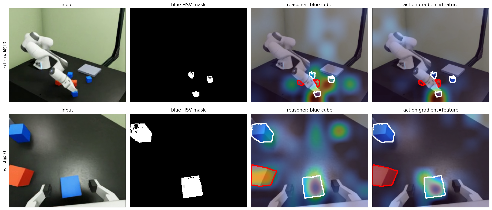
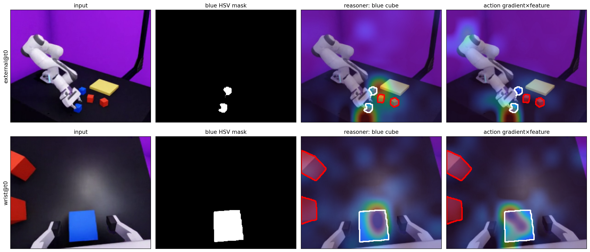
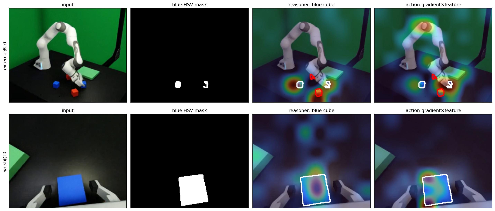

# Franka synthetic data → GR00T N1.7 → IsaacLab Arena

This directory is a shareable, end-to-end reference package for generating a
Franka blue-cube dataset in Isaac Lab, converting it to LeRobot v2.1,
fine-tuning GR00T N1.7, and evaluating the checkpoint in IsaacLab Arena. The
scripts use the two verified fork branches below; model weights and generated
datasets remain outside Git.

> **Reference run:** all bundled assets and metrics below come from the completed
> v4 no-detour run on 2026-07-24. They are real generation, analysis, SFT, and
> 300-episode Arena outputs rather than placeholders.

## Package layout

```text
franka_groot_e2e/
├── README.md
├── install_franka_groot_e2e.sh       # path-aware one-shot installer
├── run_pipeline.sh                    # resumable stage supervisor
├── run_v5_waypoint10_recovery1.sh     # complete v5 launcher
├── scripts/
│   ├── 01_generate/     # Isaac Lab generation and trajectory analysis
│   └── 02_convert/      # Isaac output → LeRobot v2.1
└── assets/
    ├── 01_generation/   # two real synthetic episodes
    ├── 02_analysis/     # trajectory, scenario, and failure graphs
    ├── 03_sft_attention/# four final-checkpoint attention maps
    └── 04_arena_eval/   # summary, HTML report, and success/failure videos
```

`IsaacLab-Scripts` intentionally owns only data generation, analysis, conversion,
and orchestration. SFT is executed from
`Isaac-GR00T:jryu/franka-demo` (`examples/Franka/train_franka.sh`), while
evaluation is executed from `IsaacLab-Arena:jryu/franka-demo`
(`isaaclab_arena_gr00t/parallel_evaluation.py`). Do not copy those implementation
files into this repository; each fork branch is its own source of truth.

The bundled assets are compact evidence from one internally consistent run:

- generation videos and all analysis artifacts come from the v4 600-attempt,
  seed-60007 dataset;
- attention maps come from the v4 `checkpoint-10000` for retained dataset
  episodes 0–3;
- Arena results come from that same checkpoint, with 100 evaluation episodes
  for each of the 1-, 2-, and 3-blue-cube tasks and seeds outside the
  generation range.

## E2E stages

1. Install three isolated Python environments and download both public models.
2. Generate and analyze Isaac Lab episodes.
3. Convert successful episodes to LeRobot v2.1.
4. Fine-tune GR00T N1.7 on eight GPUs with W&B online logging.
5. Run 100 Arena episodes per task on eight GPUs and review the bundled report.

### One-command install and launch at a customer-selected path

Clone only this script repository first, then let the installer clone the two
verified implementation branches, create all three isolated environments, and
download both public models. `--workspace-root` controls every unspecified
repo, model, venv, dataset, checkpoint, and evaluation path. Individual path
flags are available when a customer needs a split filesystem.

```bash
CUSTOM_ROOT=/data/franka-groot
mkdir -p "${CUSTOM_ROOT}"

git clone --branch main --single-branch \
  https://github.com/jihyeonRyu/IsaacLab-Scripts.git \
  "${CUSTOM_ROOT}/IsaacLab-Scripts"

bash "${CUSTOM_ROOT}/IsaacLab-Scripts/franka_groot_e2e/install_franka_groot_e2e.sh" \
  --workspace-root "${CUSTOM_ROOT}" \
  --scripts-repo "${CUSTOM_ROOT}/IsaacLab-Scripts" \
  --accept-eula

source "${CUSTOM_ROOT}/franka_groot_env.sh"
"${GROOT_REPO}/.venv/bin/wandb" login

nohup bash "${SCRIPTS_REPO}/franka_groot_e2e/run_v5_waypoint10_recovery1.sh" \
  --workspace-root "${CUSTOM_ROOT}" \
  --scripts-repo "${SCRIPTS_REPO}" \
  > "${CUSTOM_ROOT}/output/franka_e2e_pipeline_waypoint10_recovery1_v5.log" 2>&1 &
```

Preview resolved paths without installing or starting a job:

```bash
bash franka_groot_e2e/install_franka_groot_e2e.sh \
  --workspace-root /data/customer-a/franka --print-config
bash franka_groot_e2e/run_v5_waypoint10_recovery1.sh \
  --workspace-root /data/customer-a/franka --print-config
```

For nonstandard layouts, both scripts accept `--groot-repo`, `--arena-repo`,
`--models-root`, and Python-path overrides. The launcher additionally accepts
raw/LeRobot/checkpoint/evaluation output overrides. Existing nonempty non-Git
paths are never overwritten, and an existing checkout must already be on the
expected branch.

## Prepared default paths

- Synthetic generator: `/workspace/IsaacLab-Scripts/franka_groot_e2e/scripts/01_generate/franka_lift_auto_parallel.py`
- Dataset converter: `/workspace/IsaacLab-Scripts/franka_groot_e2e/scripts/02_convert/convert_franka_to_groot_lerobot.py`
- Trajectory/scenario analyzer: `/workspace/IsaacLab-Scripts/franka_groot_e2e/scripts/01_generate/analyze_franka_trajectories.py`
- GR00T repository/venv: `/workspace/Isaac-GR00T`, `.venv`
- Arena repository/venv: `/workspace/IsaacLab-Arena`, `.venv`
- GR00T N1.7: `/workspace/models/GR00T-N1.7-3B`
- Cosmos Reason2: `/workspace/models/Cosmos-Reason2-2B`
- Hugging Face cache: `/workspace/models/huggingface-cache`

These are defaults only. Passing `--workspace-root` changes all of them, and the
installer writes the resolved values to `<workspace-root>/franka_groot_env.sh`.
The GR00T runtime receives `HF_HOME`, `BASE_MODEL_PATH`, and
`GROOT_COSMOS_MODEL_PATH` explicitly from the supervisor.

### Detached sequential execution

`run_pipeline.sh` validates generation and then runs analysis,
successful-episode LeRobot conversion, 8-GPU SFT, and
100-episode-per-task Arena evaluation in order. `run_v4_no_detour.sh` supplies
the completed v4 paths and generation arguments. Each completed stage has a
marker under `/workspace/output/franka_e2e_pipeline_no_detour_recovery_v4`, so
rerunning the supervisor resumes after the last completed stage.

```bash
nohup bash /workspace/IsaacLab-Scripts/franka_groot_e2e/run_v4_no_detour.sh \
  > /workspace/output/franka_e2e_pipeline_no_detour_recovery_v4.log 2>&1 &
```

Closing the terminal or the client computer does not stop this server-side job.
The Docker container and its host server must remain running; shutting down
either one stops all processes.

## 0. Rebuild the Docker environments

The supported fast path is the one-shot installer above:

```bash
bash franka_groot_e2e/install_franka_groot_e2e.sh \
  --workspace-root /your/persistent/path \
  --scripts-repo /path/to/IsaacLab-Scripts \
  --accept-eula
```

It installs OS libraries unless `--skip-system-packages` is supplied, validates
Python 3.12 and repository branches, creates the Isaac/GR00T/Arena environments,
runs dependency checks, downloads both public models unless
`--skip-model-download` is supplied, and writes a sourceable path file. It does
not persist Hugging Face or W&B tokens. The remaining subsections show the same
steps manually for debugging and auditing.

### Docker image recommendation

The completed local E2E jobs did **not** run inside the currently running VS Code
sidecar. They ran on the Ubuntu 24.04 host with eight RTX PRO 6000 Blackwell GPUs
and NVIDIA driver 595.71.05. Docker Compose currently also has this development
image running:

```text
isaac-lab-vscode:latest
sha256:a9eed40147f216b910a88352372fcb9b243978a4759a2ec7ffdd9909b555a7e6
```

That sidecar does not mount this host's `/workspace`, and `latest` is mutable,
so it is not a sufficient customer reproduction reference. For delivery, use a
customer-built, digest-pinned Ubuntu 24.04 NVIDIA GPU image with a CUDA
12.8-compatible userspace (the GR00T lock uses PyTorch `+cu128`), then run the
one-shot installer inside it. Expose all GPUs with NVIDIA Container Toolkit,
mount the selected workspace path as persistent storage, use `--ipc=host` (or a
large shared-memory allocation), and preserve the Isaac/RTX device access. The
host driver may be newer than the container CUDA runtime; the host CUDA toolkit
version is not the dependency source for these venvs.

If the existing `isaac-lab-vscode` image is used as a starting point, pin the
shown digest and add the customer's workspace mount explicitly. Still keep the
three venvs isolated: preinstalled Isaac or PyTorch packages in a mutable dev
image must not replace the lockfile/pip environments documented here.

Do not install the full workflow into one Python environment. The working
container uses three isolated Python 3.12 environments because the GR00T and
Isaac stacks require incompatible PyTorch and NumPy versions:

| environment | purpose | package stack |
| --- | --- | --- |
| `/workspace/env_isaaclab` | synthetic generation and trajectory analysis | pip, Isaac Sim 6.0.1.0, Isaac Lab 3.0.0b2.post1, Torch 2.11.0, NumPy 2.3.1 |
| `/workspace/Isaac-GR00T/.venv` | LeRobot conversion, training, and GR00T server | uv lock, Torch 2.9.0+cu128, NumPy 1.26.4, GR00T editable install |
| `/workspace/IsaacLab-Arena/.venv` | Arena parallel launcher and tests | uv lock, Isaac Sim 6.0.0.1, Isaac Lab 3.0.0b2, Torch 2.11.0+cu128, NumPy 2.3.1 |

The completed parallel evaluation starts the launcher from the Arena venv, but
uses `/workspace/env_isaaclab/bin/python` for each Isaac simulation worker.
Its manifest therefore records Isaac Sim 6.0.1.0 and Isaac Lab
3.0.0b2.post1; GR00T policy servers run in the separate GR00T venv.

Clone the verified branches:

```bash
cd /workspace
git clone --branch jryu/franka-demo --single-branch \
  https://github.com/jihyeonRyu/Isaac-GR00T.git
git clone --branch jryu/franka-demo --single-branch \
  https://github.com/jihyeonRyu/IsaacLab-Arena.git
git clone --branch main --single-branch \
  https://github.com/jihyeonRyu/IsaacLab-Scripts.git
```

Verified revisions: GR00T `d6ee11a`, Arena `e0dd76c`, and Scripts `7527c41`
before this result-documentation update.

### 0.1 Install the uv bootstrap

`uv` itself was installed with pip into a small standalone venv. GR00T and
Arena are then resolved from their checked-in `uv.lock` files:

```bash
/usr/bin/python3 -m venv /workspace/.uv-bootstrap
/workspace/.uv-bootstrap/bin/python -m pip install --upgrade pip
/workspace/.uv-bootstrap/bin/python -m pip install uv==0.11.31
export UV=/workspace/.uv-bootstrap/bin/uv
```

### 0.2 Synthetic generation environment: pip install

This is the only main environment installed directly with pip. The Isaac Lab
extra pulls the matching Isaac Sim wheel set:

```bash
/usr/bin/python3 -m venv /workspace/env_isaaclab
source /workspace/env_isaaclab/bin/activate
python -m pip install --upgrade pip setuptools wheel
python -m pip install \
  --extra-index-url https://pypi.nvidia.com \
  "isaaclab[isaacsim,all]==3.0.0b2.post1"
# Arena simulation workers run in this venv and need the GR00T ZeroMQ protocol.
python -m pip install msgpack-numpy==0.4.8 pyzmq==27.1.0
export OMNI_KIT_ACCEPT_EULA=YES ACCEPT_EULA=Y
python -m pip check
```

Installed core versions:

```text
isaacsim               6.0.1.0
isaaclab               3.0.0b2.post1
torch/vision/audio     2.11.0 / 0.26.0 / 2.11.0
numpy                  2.3.1
opencv-python-headless 4.13.0.90
```

`IsaacLab-Scripts` is a script repository and needs no editable pip install.
Run its generator and analyzer with `/workspace/env_isaaclab/bin/python`.

### 0.3 GR00T conversion/training/server environment: uv sync

GR00T was installed from its lockfile, not dependency by dependency:

```bash
cd /workspace/Isaac-GR00T
/workspace/.uv-bootstrap/bin/uv sync --frozen --python 3.12
source .venv/bin/activate
/workspace/.uv-bootstrap/bin/uv pip check --python .venv/bin/python
```

Important resolved versions:

```text
gr00t                  0.1.0 (editable)
torch/torchvision      2.9.0+cu128 / 0.24.0+cu128
numpy/pandas           1.26.4 / 2.2.3
transformers           4.57.3
diffusers/peft         0.35.1 / 0.17.1
flash-attn/deepspeed   2.8.3 / 0.17.6
torchcodec/wandb       0.8.0 / 0.23.0
msgpack-numpy/pyzmq    0.4.8 / 27.0.1
```

`torchcodec==0.8.0` supports FFmpeg 4 through 7. This container installed its
local FFmpeg 7 runtime with:

```bash
/workspace/.tools/micromamba/bin/micromamba create \
  -p /workspace/.tools/ffmpeg-7 -c conda-forge "ffmpeg<8" -y
export LD_LIBRARY_PATH="/workspace/.tools/ffmpeg-7/lib${LD_LIBRARY_PATH:+:$LD_LIBRARY_PATH}"
```

For a clean rebuild, export these paths explicitly or put them in a wrapper
script rather than relying on generated activation-file edits:

```bash
export HF_HOME=/workspace/models/huggingface-cache
export GROOT_COSMOS_MODEL_PATH=/workspace/models/Cosmos-Reason2-2B
```

### 0.4 Download both local models

The `hf` CLI comes from the GR00T lock. Both model repositories are public, so no Hugging Face login or token is required:

```bash
cd /workspace/Isaac-GR00T
source .venv/bin/activate
mkdir -p /workspace/models/huggingface-cache
export HF_HOME=/workspace/models/huggingface-cache
hf download nvidia/GR00T-N1.7-3B \
  --local-dir /workspace/models/GR00T-N1.7-3B
hf download nvidia/Cosmos-Reason2-2B \
  --local-dir /workspace/models/Cosmos-Reason2-2B
```

Once downloaded, conversion, training, and evaluation use local model paths.

### 0.5 Arena launcher environment: uv sync plus RPC packages

```bash
cd /workspace/IsaacLab-Arena
/workspace/.uv-bootstrap/bin/uv sync --frozen --python 3.12
source .venv/bin/activate
# Install these after uv sync for the GR00T ZeroMQ protocol.
python -m pip install msgpack-numpy==0.4.8 pyzmq==27.0.1
python -m pip check
export OMNI_KIT_ACCEPT_EULA=YES ACCEPT_EULA=Y
```

Arena's locked stack is Isaac Sim 6.0.0.1, Isaac Lab 3.0.0b2, Torch
2.11.0+cu128, and NumPy 2.3.1. Isaac/Kit also needs `libICE.so.6`,
`libSM.so.6`, and `libXt.so.6`:

```bash
apt-get update
apt-get install -y libice6 libsm6 libxt6t64
```

This rootless container extracted those libraries under a local prefix instead:

```bash
export LD_LIBRARY_PATH="/workspace/.tools/isaac-system-libs/usr/lib/x86_64-linux-gnu${LD_LIBRARY_PATH:+:$LD_LIBRARY_PATH}"
```

Run `uv sync` before the two manual RPC packages; a later sync can remove
packages that are not declared by the Arena lock. The actual Isaac simulation
workers use `/workspace/env_isaaclab`, so the same RPC imports must also be
installed there as shown in section 0.2.

## 1. Generate synthetic episodes

Run from the dedicated Isaac Lab generation venv. This command launches the current
600-episode refresh on eight GPUs while preserving the validated camera geometry.

```bash
cd /workspace/IsaacLab-Scripts
source /workspace/env_isaaclab/bin/activate

python /workspace/IsaacLab-Scripts/franka_groot_e2e/scripts/01_generate/franka_lift_auto_parallel.py \
  --headless \
  --enable_cameras \
  --num_envs 4 \
  --auto_generate_episodes 600 \
  --gpu_ids 0 1 2 3 4 5 6 7 \
  --asset_version_override 5.1 \
  --sensor_modalities rgb \
  --output_dir /workspace/output/franka_no_detour_posture_recovery_600eps_seed60007_v4 \
  --fps 15 \
  --width 320 \
  --height 256 \
  --no_realtime \
  --seed 60007 \
  --recovery_waypoint_prob 0.0 \
  --solver_recovery_max_attempts 3
```

The automatic mode enables action/state logs, external and wrist RGB capture, and MP4 output. Successful episodes have `logs/result.json` with `completed=true` and `failed=false`.

Bundled successful external-camera examples from the training dataset:

| scenario | episode | video |
| --- | ---: | --- |
| one blue cube | 497 | [MP4](assets/01_generation/one_cube_success_episode_000497.mp4) |
| three blue cubes | 361 | [MP4](assets/01_generation/three_cubes_success_episode_000361.mp4) |

Current generation defaults:

- loose cube/tray workspace: X `0.33–0.70 m`, Y `-0.34–0.34 m`, maximum radius `0.68 m`;
- randomized start EEF: X `0.36–0.70 m`, Y `-0.34–0.34 m`, Z `0.25–0.55 m`, safe radius `0.40–0.72 m`;
- start-pose augmentation translates only and preserves the validated floor-facing tool orientation;
- tray side alternates by episode and cube sampling covers both lateral table halves;
- the completed v4 dataset disables deliberate pre-grasp off-target waypoints
  with `recovery_waypoint_prob=0.0`;
- yaw alignment is followed by a 6 mm post-yaw recenter, and XY centering remains enforced while descending and closing;
- an IK stall while holding a cube raises vertically at fixed XY before retrying placement; an unladen stall uses safe raise, neutral recenter, and an optional restoration of the validated floor-facing tool quaternion;
- quaternion restoration follows the shortest arc while holding the neutral EEF position; after 480 control steps it continues with a logged partial recovery when the tool is already inside the validated floor-facing tilt limit, so an unreachable exact quaternion cannot create a new terminal failure;
- solver recovery allows up to 3 retries per cube before marking the episode failed;
- when domain randomization is enabled, each background RGB channel is sampled independently over the full `[0, 1]` range; task lighting remains near-neutral.

### v4 no-detour ablation

The v4 ablation removes the deliberate pre-grasp off-target waypoint while
retaining randomized collision-safe start poses, post-yaw recentering, and
failure-triggered solver recovery. It uses a new generation seed and separate
raw dataset, LeRobot dataset, checkpoint, pipeline state, and Arena output so
the v3 result remains a valid baseline.

To wait for an existing Arena evaluation and then run generation, analysis,
conversion, 8-GPU SFT, and the 300-episode Arena evaluation:

```bash
cd /workspace/IsaacLab-Scripts

nohup env WAIT_FOR_PID=<arena-launcher-pid> \
  bash franka_groot_e2e/run_v4_no_detour.sh \
  > /workspace/output/franka_e2e_pipeline_no_detour_recovery_v4.log 2>&1 &
```

The only deliberate-trajectory augmentation change from the v3 ablation
baseline is `--recovery_waypoint_prob 0.0`. Actual failure-triggered recovery
remains enabled with up to three attempts per cube, and only successful
episodes are retained by the LeRobot conversion stage.

The completed v4 generation produced 549 successful episodes from 600 attempts
(91.5%). Scenario completion was 187/202 for one cube, 195/205 for two cubes,
and 167/193 for three cubes. No episode planned or executed an off-target
waypoint.

### v5 waypoint-10% / one-retry ablation

`run_v5_waypoint10_recovery1.sh` restores the short pre-grasp off-target
waypoint for 10% of targets and limits failure-triggered solver recovery to one
attempt per cube. It uses generation seed 70007 and separate raw, LeRobot,
checkpoint, pipeline-state, and Arena output paths.

```bash
cd /workspace/IsaacLab-Scripts

nohup bash franka_groot_e2e/run_v5_waypoint10_recovery1.sh \
  --workspace-root /workspace \
  > /workspace/output/franka_e2e_pipeline_waypoint10_recovery1_v5.log 2>&1 &
```

The detached command automatically runs 600-episode generation, trajectory
analysis, successful-episode LeRobot conversion, 8-GPU GR00T SFT, and the
aligned 8-GPU Arena evaluation with 100 episodes for each cube count.

Vectorized generation samples loose objects against each environment slot's
actual fixed tray pose; it never shifts only the tray metadata after sampling.
The yaw-conservative object footprint is checked again after vector asset-size
adaptation, and generation fails fast if any initial object touches the tray.
This path was stress-tested with:

```bash
python franka_groot_e2e/scripts/01_generate/franka_lift_auto_parallel.py \
  --headless \
  --no-multi_gpu \
  --num_envs 4 \
  --validate_layouts_only 2000 \
  --seed 50007 \
  --asset_version_override 5.1
```

All 2,000 fixed-tray layouts passed with zero tray/object footprint overlaps;
the blue-cube counts stayed balanced at 680 one-cube, 644 two-cube, and 676
three-cube scenarios. A separate four-environment Isaac physics smoke test also
recorded zero initial footprint overlaps.
It completed 4/4 episodes and 8/8 pick-place operations without recovery exhaustion.

### Analyze trajectory coverage and scenario success

The analyzer reads the measured `ee_pos_env` from `logs/states.jsonl`; it does
not reconstruct motion by integrating commanded actions.

```bash
cd /workspace/IsaacLab-Scripts
source /workspace/env_isaaclab/bin/activate

python /workspace/IsaacLab-Scripts/franka_groot_e2e/scripts/01_generate/analyze_franka_trajectories.py \
  /workspace/output/franka_no_detour_posture_recovery_600eps_seed60007_v4 \
  --output-dir /workspace/output/franka_no_detour_posture_recovery_600eps_seed60007_v4/trajectory_analysis
```

Outputs:

```text
trajectory_distribution.png
trajectory_by_blue_cube_count.png
scenario_statistics.png
failure_analysis.png
failure_analysis.json
episode_metrics.csv
scenario_success.csv
failure_causes.csv
solver_recovery_outcomes.csv
scenario_summary.json
```

The figures include X–Y, X–Z, Y–Z, and 3D measured EEF trajectories. Trajectories
are grouped by the number of blue cubes, with solid success and dashed failure
lines. The CSV/JSON files include episode counts, success/failure counts and rates,
frames, durations, measured path lengths, and X/Y/Z ranges and spans.
`failure_analysis.png` adds terminal failure reasons, failed FSM states,
success/failure by total solver-recovery use, and failed-state counts by blue-cube
scenario. The matching JSON/CSV files retain episode-level reasons and retry counts.

Bundled analysis figures:

<p>
  
  
</p>
<p>
  
  
</p>

All four figures describe the v4 training source. The measured EEF range was
X `0.3568–0.7251 m`, Y `-0.3552–0.3549 m`, and Z `0.0208–0.5463 m`.
There were 51 failures: 47 `solver_recovery_exhausted`, three `state_timeout`,
and one `placement_verification`. Exact counts are in
[failure_analysis.json](assets/02_analysis/failure_analysis.json), with the
full scenario summary in
[scenario_summary.json](assets/02_analysis/scenario_summary.json).

## 2. Convert to LeRobot v2.1

```bash
cd /workspace/Isaac-GR00T
source .venv/bin/activate

python /workspace/IsaacLab-Scripts/franka_groot_e2e/scripts/02_convert/convert_franka_to_groot_lerobot.py \
  /workspace/output/franka_no_detour_posture_recovery_600eps_seed60007_v4 \
  /workspace/datasets/franka_no_detour_posture_recovery_seed60007_v4_lerobot
```

The converter:

- keeps successful episodes by default;
- aligns actions, states, and both videos by `sim_step`;
- converts XYZW quaternion state to the exact 6D rotation convention used by the Arena policy;
- writes `eef_pose(9) + gripper(1)` state and `eef_delta(6) + gripper(1)` action;
- validates FPS, resolution, MP4 frame counts, Parquet metadata, and normalization statistics;
- refuses to overwrite a non-empty output directory.

Use `--allow-incomplete` only when intentionally skipping malformed recordings. Use `--include-failed` only for diagnostics, not normal imitation learning.

### Current converted dataset specification

- Dataset: `/workspace/datasets/franka_no_detour_posture_recovery_seed60007_v4_lerobot` (LeRobot v2.1)
- Episodes: 549
- Total frames: 359,549 at 15 FPS
- Cameras: `external` and `wrist`, RGB 320×256
- Image input: current frame only (`delta_indices=[0]`)
- Robot state: current absolute EEF XYZ + rotation 6D and gripper width (10D total)
- Action horizon: 40 frames, approximately 2.67 seconds at 15 FPS
- EEF action: stored delta XYZ + delta rotvec (6D)
- Gripper action: stored absolute `-1/1` command (1D)
- Language: `annotation.human.action.task_description`
- Normalization: 1st/99th-percentile min-max to `[-1, 1]`, with outlier clipping

The action training target is:

```text
action[t:t+40]
→ collect the stored delta EEF and absolute gripper values
→ q01/q99 percentile min-max normalization
→ diffusion action-head target
```

The v4 generation completion and retained training data by blue-cube count are:

| blue cubes | attempts | successful/retained episodes | generation success | retained frames |
| ---: | ---: | ---: | ---: | ---: |
| 1 | 202 | 187 | 92.57% | 62,387 |
| 2 | 205 | 195 | 95.12% | 130,538 |
| 3 | 193 | 167 | 86.53% | 166,624 |
| total | 600 | 549 | 91.50% | 359,549 |

These generation rates measure scripted data-generation completion. They are not
the trained policy's Arena evaluation success rates.

## 3. Fine-tune GR00T on 8 GPUs

Authenticate W&B once, then run the checked-in launcher. The Hugging Face models are
already stored locally, so training does not depend on an online model download.

```bash
cd /workspace/Isaac-GR00T
source .venv/bin/activate
wandb login

bash /workspace/Isaac-GR00T/examples/Franka/train_franka.sh
```

The current defaults are the reproducible full-run settings:

- 8 GPUs and global batch size 64;
- 10,000 optimizer steps, checkpoint every 250 steps;
- `crop_fraction=0.98` with shortest image edge 256;
- state dropout 0.20;
- brightness/contrast/saturation/hue jitter 0.25/0.25/0.30/0.03;
- W&B online project `franka-gr00t`;
- frozen visual-language reasoner (`TUNE_LLM=0`), with projector and diffusion head trained;
- four debug samples (episodes 0, 1, 2, and 3 at frame 120) at every saved checkpoint.

The completed v4 run is:

```text
/workspace/Isaac-GR00T/outputs/franka-groot-sft/
  franka-blue-cube-sft-fixedtray-no-detour-recovery-v4/checkpoint-10000
```

It completed in 5,669.8 seconds (about 1 h 34 min 30 s), with final aggregate
training loss `0.07303` and last logged step loss `0.0371`. Its W&B run is
`nv-default-onboard/franka-gr00t/6e8h25gx`. The final four local attention
images are under:

```text
/workspace/Isaac-GR00T/outputs/attention/
  franka-blue-cube-sft-fixedtray-no-detour-recovery-v4/
  checkpoint-10000-ep{0,1,2,3}-step120.png
```

The reasoner attention panels use the dataset task prompt stored in LeRobot metadata.
They show Cosmos attention for that prompt and input image. With `TUNE_LLM=0`, raw
reasoner attention is expected to remain mostly fixed; action saliency can still change
because the projector and action head are trained.

Final checkpoint attention examples, all evaluated with the dataset task prompt:

<p>
  
  
</p>
<p>
  
  
</p>

For a short pipeline check, override `NUM_GPUS=1 GLOBAL_BATCH_SIZE=2 MAX_STEPS=2
SAVE_STEPS=2 DATALOADER_NUM_WORKERS=0 EXPERIMENT_NAME=franka-blue-cube-smoke`.

## 4. Evaluate the checkpoint in Arena on 8 GPUs

The parallel launcher starts one GR00T server per physical GPU and launches a fresh
Arena worker for each task stage on that GPU. Each process uses `cuda:0` inside its
own `CUDA_VISIBLE_DEVICES` namespace. Install the
small RPC dependencies in the Arena venv once if they are not already present:

```bash
cd /workspace/IsaacLab-Arena
source .venv/bin/activate
python -m pip install msgpack-numpy==0.4.8 pyzmq==27.0.1
```

Run the 100-episode-per-task evaluation (300 episodes total):

```bash
cd /workspace/IsaacLab-Arena
source .venv/bin/activate

python /workspace/IsaacLab-Arena/isaaclab_arena_gr00t/parallel_evaluation.py \
  --checkpoint /workspace/Isaac-GR00T/outputs/franka-groot-sft/franka-blue-cube-sft-fixedtray-no-detour-recovery-v4/checkpoint-10000 \
  --num-gpus 8 \
  --episodes-per-task 100 \
  --base-port 5655 \
  --output-dir /workspace/IsaacLab-Arena/outputs/franka-gr00t-parallel/fixedtray-no-detour-recovery-v4-generation-aligned-8gpu-100eps
```

Port 5655 is used because another service may occupy the default port 5555. The
launcher checks all requested GPUs, model/config paths, and the complete port range
before starting any child process. It also supplies the local Cosmos path and required
Isaac Sim EULA environment variables.

Evaluation deliberately uses seeds distinct from data generation:

| task | base seed | rank seeds |
| --- | ---: | --- |
| one blue cube | 10007 | 10007–10014 |
| two blue cubes | 20007 | 20007–20014 |
| three blue cubes | 30007 | 30007–30014 |

The 100 episodes for each task are split across the eight workers as
`[13, 13, 13, 13, 12, 12, 12, 12]`. Every worker runs one Arena environment, which avoids
multiplying the policy server batch unexpectedly. Recorder HDF5 datasets are written
inside each run output directory with a rebuild-specific filename, so concurrent
workers never contend for `/tmp/isaaclab/logs`.

Each task starts in a new Isaac Sim process, and the launcher passes synchronous
RTX geometry-loading arguments. This avoids stale Fabric/RTX transforms after
stage rebuilds. Arena uses the same generation-aligned camera, lighting, fixed
5 cm cube geometry, workspace, reset settling, and randomized collision-safe
start-pose setup as the v4 generator. Only the evaluation seeds differ. The
unrecorded setup motion is solver-driven; every recorded task action is produced
by the GR00T policy.

Camera visualization is enabled by default. The launcher records external and wrist
MP4s, keeps per-rank HTML reports and logs, and writes these aggregate outputs:

```text
<output-dir>/parallel_eval_manifest.json
<output-dir>/summary.json
<output-dir>/index.html
<output-dir>/logs/server-rank-*.log
<output-dir>/logs/arena-<task>-rank-*.log
<output-dir>/rank-*/stage-<task>/...
```

Use `--no-record-camera-video` only for a deliberately faster non-visual evaluation.
The renderer is Isaac Sim's `IsaacRtxRenderer` real-time RTX backend; this workflow
does not enable path tracing.

Policy/camera observations update at 15 Hz, matching generation. Arena steps
control at 60 Hz, and its current recorder writes one observation per control
step into a 60 FPS MP4, so each 15 Hz camera image is repeated for four video
frames. The bundled Arena MP4s are therefore 60 FPS containers with a 15 Hz
effective visual refresh; generation MP4s are native 15 FPS.

Final trained-policy success by blue-cube count:

| blue cubes | v3 successes/rate | v4 successes/rate | v4 − v3 |
| ---: | ---: | ---: | ---: |
| 1 | 79/100 (79%) | 74/100 (74%) | -5%p |
| 2 | 38/100 (38%) | 30/100 (30%) | -8%p |
| 3 | 13/100 (13%) | 11/100 (11%) | -2%p |
| total | 130/300 (43.33%) | 115/300 (38.33%) | -5%p |

Removing the deliberate near-cube waypoint did not improve the aligned Arena
result. Because v4 also uses a fresh generation seed and a newly trained model,
this comparison does not prove that the waypoint itself is beneficial; it shows
that waypoint removal alone is not the missing fix.

Bundled external-camera examples are matched directly to their
`episode_results_rebuild0.jsonl` records:

| Arena task | successful episode | failed episode |
| --- | --- | --- |
| one blue cube | [seed 10007, episode 0](assets/04_arena_eval/videos/one_cube_success.mp4) | [seed 10009, episode 2](assets/04_arena_eval/videos/one_cube_failure.mp4) |
| two blue cubes | [seed 20007, episode 1](assets/04_arena_eval/videos/two_cubes_success.mp4) | [seed 20007, episode 0](assets/04_arena_eval/videos/two_cubes_failure.mp4) |
| three blue cubes | [seed 30007, episode 8](assets/04_arena_eval/videos/three_cubes_success.mp4) | [seed 30007, episode 0](assets/04_arena_eval/videos/three_cubes_failure.mp4) |

The archived machine-readable results are
[summary.json](assets/04_arena_eval/summary.json) and
[parallel_eval_manifest.json](assets/04_arena_eval/parallel_eval_manifest.json).
Open [the bundled Arena HTML report](assets/04_arena_eval/index.html) for the
full per-rank browser view.

The checkpoint predicts a 40-action horizon. Arena executes the first 16 actions
(`action_chunk_length=16`) before requesting a new chunk. This `16` is an action
count, not 16 Hz. Each action advances at `policy_hz=15`, matching the 15 FPS
training data, while 60 Hz control interpolation supplies four control steps per
policy action. Consequently Arena replans after about `16/15 = 1.07` seconds.

A 24-action training horizon is a reasonable later ablation (1.6 seconds at
15 Hz), but v5 deliberately keeps 40 so its only data-policy changes are the
10% successful pre-grasp waypoint and one recovery attempt. Changing horizon to
24 in the same run would confound that comparison. If v5 establishes a baseline,
run a separate v6 with only the training horizon changed while retaining Arena's
16-action execution chunk.

### Recommended next collection

For the next controlled run, keep the deliberate near-cube waypoint disabled
and keep failure-triggered recovery, but change one factor at a time:

- sample 70–80% of randomized starts from the nominal/evaluation-relevant
  workspace and only 20–30% from the widened edge envelope, instead of spreading
  all samples uniformly over the broad range;
- retain successful one- and two-attempt recovery trajectories, but separately
  tag or down-weight three-attempt trajectories; in v4, 0/1/2-attempt episodes
  completed at 99.34%, 98.15%, and 100%, while the three-attempt group completed
  at 22.22%;
- collect targeted successful re-centering examples for `approach`,
  `align_yaw`, and `move_above_slot`, which account for 42 of the 51 generator
  failures;
- balance by successful pick-place transitions as well as episode count, and
  preserve a denser nominal distribution for the repeated second/third pick.

Use the same generation/evaluation scene parameters and fixed evaluation seeds
for the next ablation. That isolates the data change from simulator alignment
and makes the comparison attributable.

## Verified in this container

- 600 v4 generation attempts produced 549 valid LeRobot v2.1 episodes and 359,549 frames at 15 FPS.
- The trajectory analyzer reproduced the generator outcomes by cube count: 187/202 for one cube, 195/205 for two cubes, and 167/193 for three cubes.
- Deliberate near-cube waypoint use was zero; failure-triggered solver recovery remained enabled.
- The converted dataset has external/wrist RGB `(256, 320, 3)`, EEF pose state 9D plus gripper 1D, and EEF delta action 6D plus gripper 1D.
- GR00T N1.7 and Cosmos Reason2 load from `/workspace/models` without a runtime Hugging Face download.
- The 8-GPU v4 training run reached step 10,000 in 5,669.8 seconds and wrote a complete `checkpoint-10000`.
- All 160 scheduled attention/debug images were produced; the bundled four are checkpoint-10,000 episodes 0–3.
- Arena cameras match generation at 15 FPS and 320×256 for both external and wrist views.
- The aligned 8-GPU Arena evaluation produced exactly 300 JSONL results and 600 MP4s with no fatal worker errors.
- The v4 evaluation completed 100 episodes per task: 74% for one cube, 30% for two cubes, and 11% for three cubes.
