# Franka synthetic data → GR00T → IsaacLab-Arena

This is the reproducible maximum-two-blue-cube workflow for Franka synthetic
generation, GR00T N1.7 SFT with EMA, and fixed-default-pose IsaacLab-Arena
evaluation.

## Latest validated result

The final Arena run uses 100 independent episodes per task, 8 GPUs,
generation-matched camera/object/tray/lighting settings, distinct evaluation
seeds, and checkpoint `/workspace/Isaac-GR00T/outputs/franka-groot-sft/franka-blue-cube-max2-robust-2000-ema/checkpoint-25000-ema`. The published validation used eight
NVIDIA RTX PRO 6000 Blackwell Server Edition GPUs with approximately 96 GiB
VRAM each.

| Task | Successes | Episodes | Success rate |
|---|---:|---:|---:|
| 1 blue cube | 98 | 100 | 98.0% |
| **2 blue cubes** | **70** | **100** | **70.0%** |

Machine-readable results: [assets/arena/summary.json](assets/arena/summary.json).

## Container and install

Run the workflow inside the pinned NVIDIA NGC base image:

```text
nvcr.io/nvidia/isaac-lab:3.0.0-beta2-post1
```

This is a standard Docker deployment; Brev is not required. On a compatible
Linux Docker host with NVIDIA Container Toolkit installed:

```bash
export HOST_WORKSPACE="$PWD/franka-workspace"
mkdir -p "${HOST_WORKSPACE}"
docker pull nvcr.io/nvidia/isaac-lab:3.0.0-beta2-post1
docker run -d --name franka-groot-e2e --restart unless-stopped \
  --gpus all \
  --network host \
  --ipc host \
  --shm-size 32g \
  -e OMNI_KIT_ACCEPT_EULA=YES \
  -e ACCEPT_EULA=Y \
  -e PRIVACY_CONSENT=Y \
  -v "${HOST_WORKSPACE}:/workspace" \
  nvcr.io/nvidia/isaac-lab:3.0.0-beta2-post1 bash -lc "sleep infinity"
docker exec -it franka-groot-e2e bash
```

Then, inside the container:

```bash
git clone https://github.com/jihyeonRyu/IsaacLab-Scripts.git \
  /workspace/IsaacLab-Scripts
bash /workspace/IsaacLab-Scripts/franka_groot_e2e/install_franka_groot_e2e.sh \
  --workspace-root /workspace \
  --num-gpus auto \
  --accept-eula
source /workspace/franka_groot_env.sh
/workspace/Isaac-GR00T/.venv/bin/wandb login
```

The installer verifies Isaac Sim 6.0.1 and Isaac Lab 3.0.0 from the image and
does not reinstall them. Isaac and Arena use the bundled `/isaac-sim/python.sh`
runtime; Arena-only dependencies live in a workspace-local user site, while
GR00T uses its own workspace venv. It auto-detects visible GPUs, accepts
`--num-gpus` and `--gpu-ids`, and downloads the public GR00T N1.7 3B and Cosmos
Reason2 2B weights. A non-container pip fallback requires the explicit
`--isaac-mode pip` option and is not the customer reference environment.

## Run end to end

```bash
source /workspace/franka_groot_env.sh
nohup bash /workspace/IsaacLab-Scripts/franka_groot_e2e/run_pipeline.sh \
  --workspace-root /workspace \
  --num-gpus "${NUM_GPUS}" \
  --gpu-ids "${GPU_IDS}" \
  > /workspace/output/franka_final_pipeline.log 2>&1 &
```

Generation, SFT, and Arena parallelism all follow `--num-gpus` and
`--gpu-ids`. Generation also accepts `--num-envs-per-gpu`; SFT accepts
`--per-gpu-batch-size` or an explicit divisible `--global-batch-size`. The
default 16 samples/GPU is the published 96 GiB setting; use 2–4 as the initial
value on 44–48 GiB GPUs.

The restart-safe stages are generation, analysis, LeRobot conversion, coverage
planning, SFT, final EMA attention, maximum-two-cube Arena evaluation, final
evidence packaging, and checkpoint cleanup. Progress is written to
`/workspace/output/franka_e2e_pipeline_final/status.log`.

For individually runnable commands, validation checkpoints, and restart guidance,
follow [STEP_BY_STEP.md](STEP_BY_STEP.md). SFT uses the maintained Isaac-GR00T
branch and evaluation uses the maintained IsaacLab-Arena branch; their source is
not duplicated in this repository.

## Synthetic generation

- attempts / seed: `2000` / `91007`;
- 8 GPUs × 4 vector environments, 15 FPS, 320×256 RGB;
- `external` and `wrist` cameras;
- one/two cube mix 25/75%;
- two-cube one-preplaced continuation probability 30%;
- stratified target grid 4×6 and start grid 4×6×3;
- start EEF X 0.36–0.70 m, Y -0.34–0.34 m, Z 0.25–0.55 m;
- 2c1p start XY radius 0–5 cm, clearance 12–20 cm, yaw -45°–45°;
- unreachable samples resolved to safe IK-boundary poses before recording;
- 10% pre-grasp near-cube recovery, radius 4–8 cm;
- one solver recovery retry; no post-grasp wandering;
- only successful trajectories enter LeRobot.

| Scenario | Successful | Attempts | Generator success rate |
|---|---:|---:|---:|
| 1 cube | 478 | 495 | 96.57% |
| 2 cubes | 1279 | 1505 | 84.98% |
| **Combined** | **1757** | **2000** | **87.85%** |

Two-cube full starts: 826/1032
(80.04%); one-preplaced continuations:
453/473
(95.77%).

Representative generation videos:

#### 2-cube full start

<video controls muted preload="metadata" width="640">
  <source src="assets/generation/2c-full-start-success-episode_000002-external.mp4" type="video/mp4">
</video>

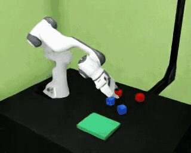

#### 2-cube one-preplaced continuation

<video controls muted preload="metadata" width="640">
  <source src="assets/generation/2c-1-preplaced-success-episode_000001-external.mp4" type="video/mp4">
</video>

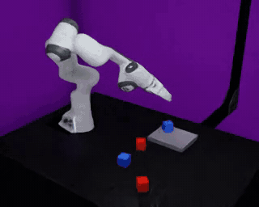

Analysis:

### Trajectory distribution

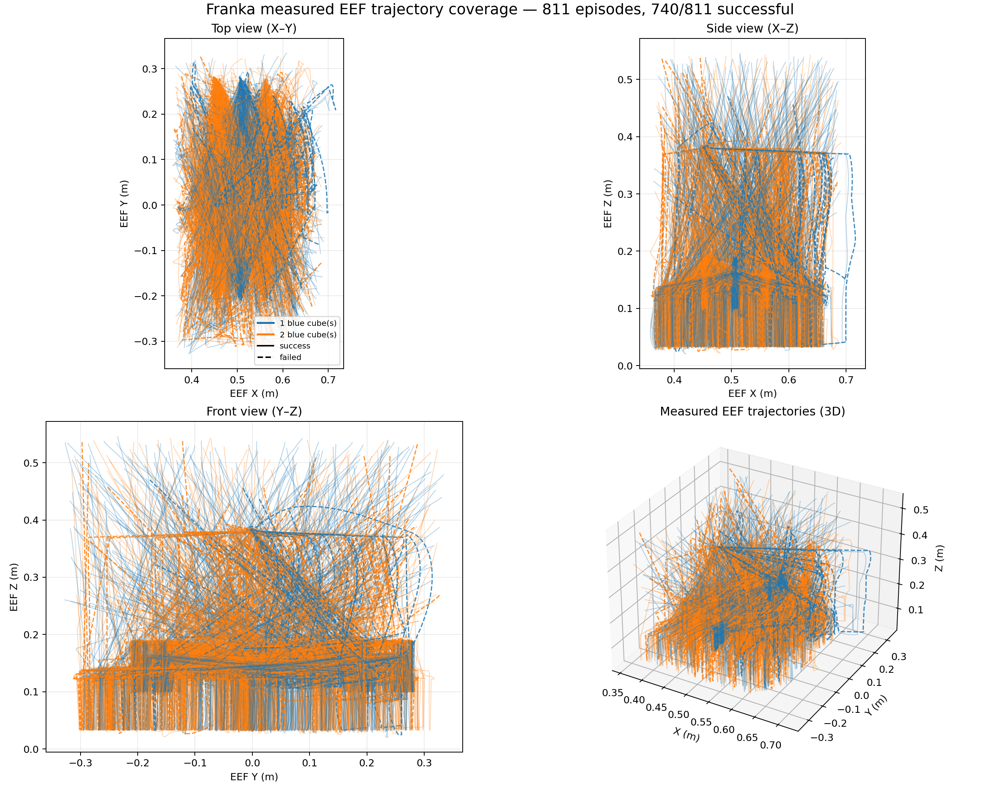

### Trajectory by cube count

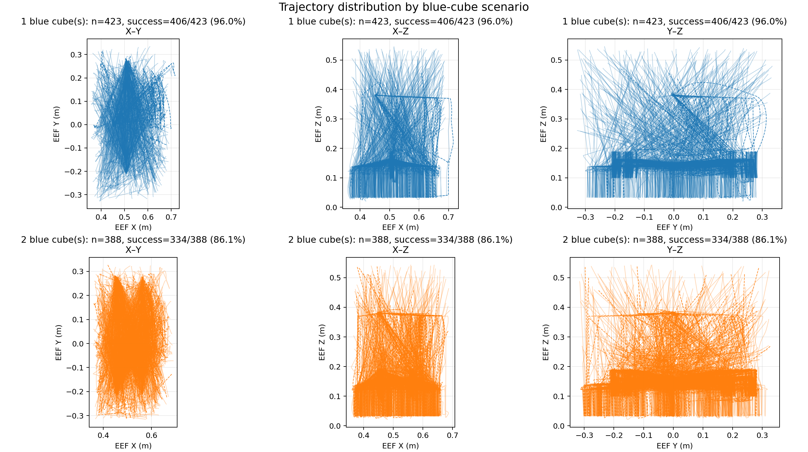

### Scenario statistics

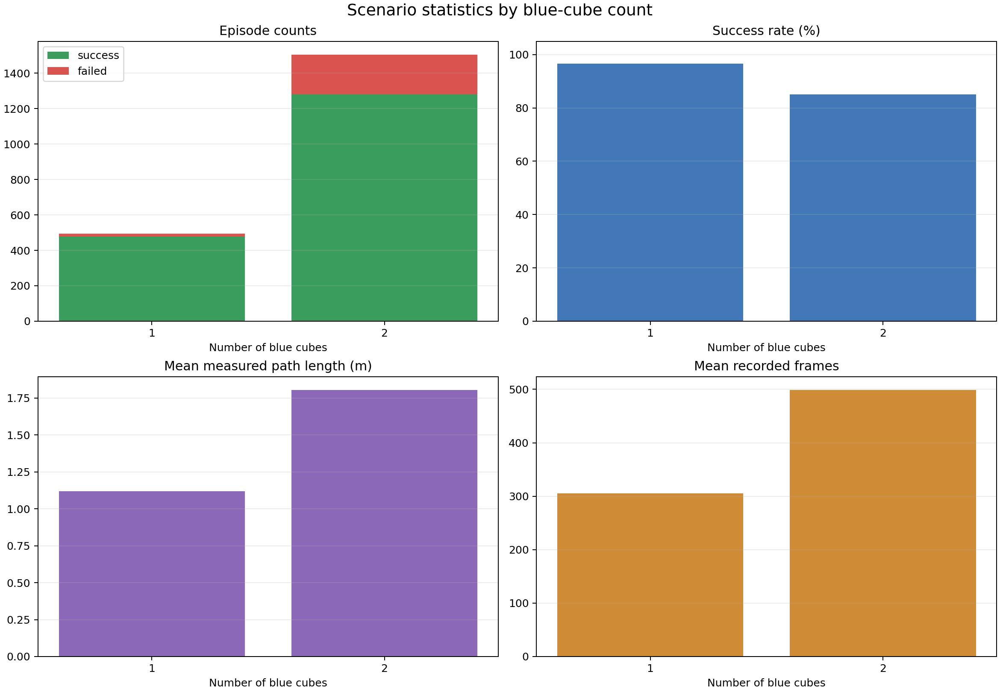

### Workspace coverage

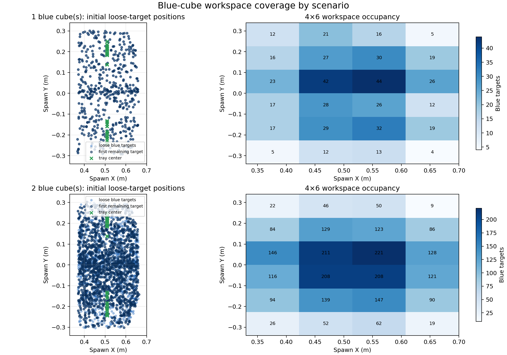

### Progress stages

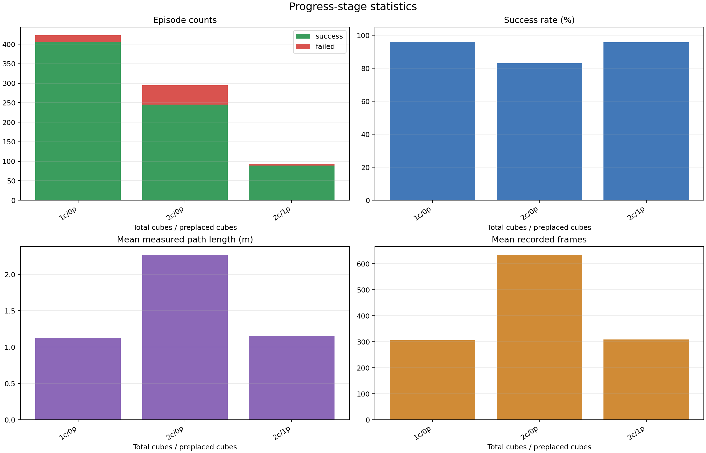

### Failure causes

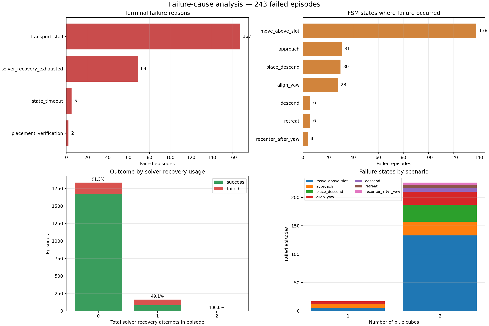

## LeRobot data contract

Dataset: 1757 successful episodes,
754545 frames at 15.0 FPS.

| Field | Contract |
|---|---|
| Images | current-frame `external` and `wrist`, 256×320 |
| State | absolute EEF XYZ + rotation 6D + gripper width, 10D |
| Action | stored delta XYZ + delta rotvec + absolute gripper command, 7D |
| Horizon | 40 frames, about 2.67 s |
| Language | `annotation.human.action.task_description` |
| Normalization | percentile min-max |

## GR00T SFT

| Setting | Value |
|---|---|
| Experiment | `franka-blue-cube-max2-robust-2000-ema` |
| GPUs / global batch | 8 / 128 |
| Steps | 25000 |
| Valid windows | 686022 |
| Nominal data passes | 4.664573439335765 |
| LR / schedule | `1e-4` / cosine, 5% warmup |
| Crop / state dropout | `0.98` / `0.2` |
| Color jitter | brightness `0.25`, contrast `0.25`, saturation `0.30`, hue `0.03` |
| EMA | FP32, decay `0.999`, every optimizer step |
| Runtime | 3h 58m 14s |

Attention probes compare the same four episode/frame samples at the first saved
training checkpoint and the final EMA checkpoint:

### First saved training checkpoint

#### checkpoint-1000-ep0-step120

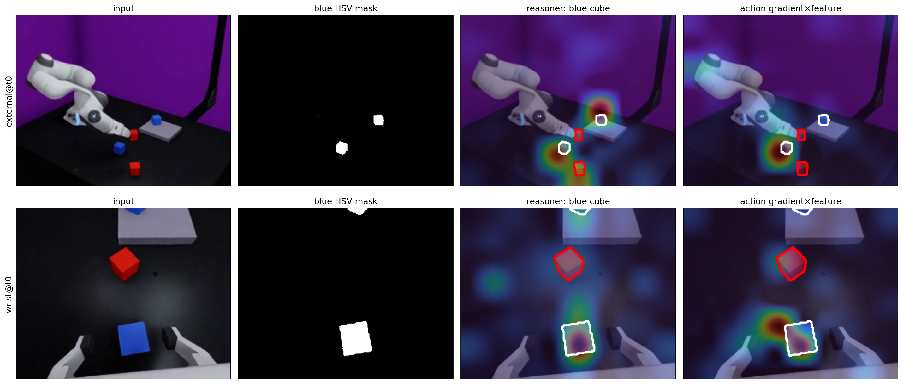

#### checkpoint-1000-ep1-step120

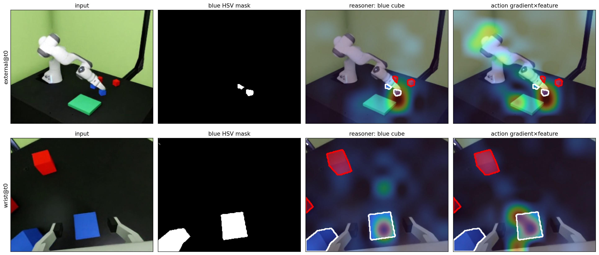

#### checkpoint-1000-ep2-step120

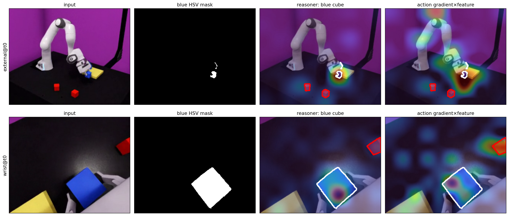

#### checkpoint-1000-ep3-step120

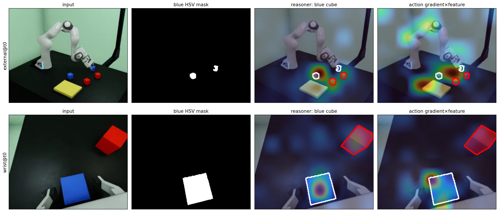

### Final EMA checkpoint

#### final-ema-episode-0-step-120

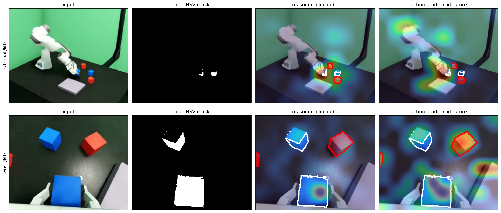

#### final-ema-episode-1-step-120

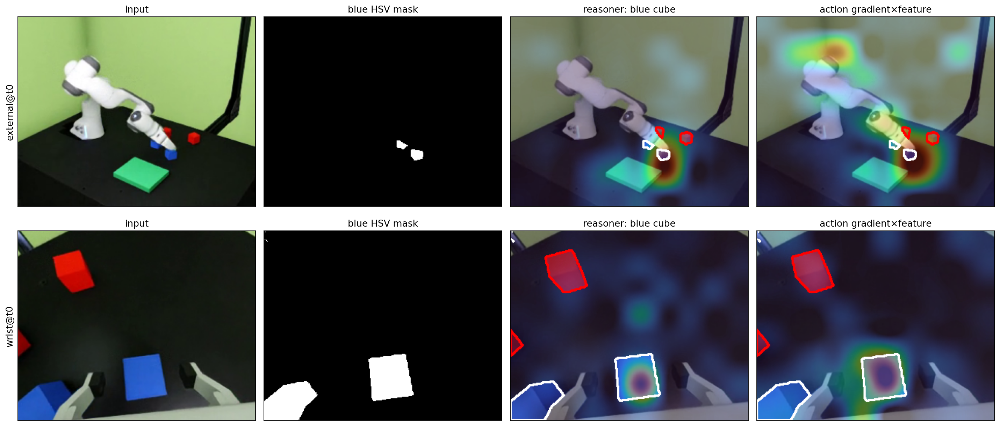

#### final-ema-episode-2-step-120

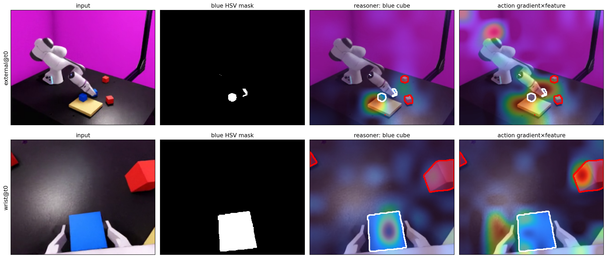

#### final-ema-episode-3-step-120

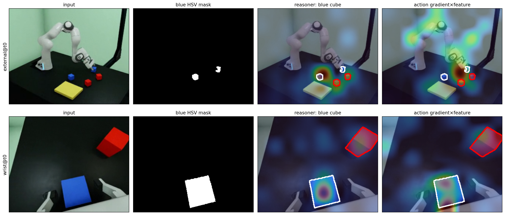

## IsaacLab-Arena evaluation

Arena runs one GR00T server and one simulator worker per GPU. It evaluates only
the 1- and 2-cube tasks, 100 episodes each, from the fixed default Franka pose.
Evaluation seeds start at 10007 and 20007, independent of generation seed
91007. GR00T predicts 40 frames and Arena executes the first 16
actions at 15 Hz before the next inference.
Arena and the synthetic generator both count a cube as placed when its center
is within the tray footprint with a 15 mm margin; Arena additionally checks
height and settled linear velocity.

### 1 cube — success

#### 1-cube success 1

<video controls muted preload="metadata" width="640">
  <source src="assets/arena/1-cube-success-01-external.mp4" type="video/mp4">
</video>

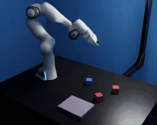

#### 1-cube success 2

<video controls muted preload="metadata" width="640">
  <source src="assets/arena/1-cube-success-02-external.mp4" type="video/mp4">
</video>

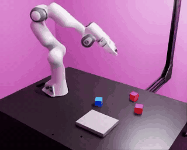

#### 1-cube success 3

<video controls muted preload="metadata" width="640">
  <source src="assets/arena/1-cube-success-03-external.mp4" type="video/mp4">
</video>

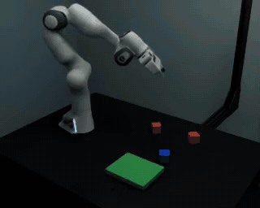

### 1 cube — failure

#### 1-cube failure 1

<video controls muted preload="metadata" width="640">
  <source src="assets/arena/1-cube-failure-01-external.mp4" type="video/mp4">
</video>

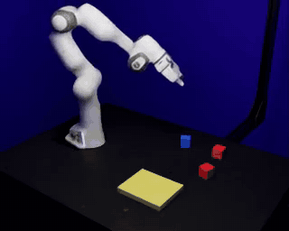

#### 1-cube failure 2

<video controls muted preload="metadata" width="640">
  <source src="assets/arena/1-cube-failure-02-external.mp4" type="video/mp4">
</video>

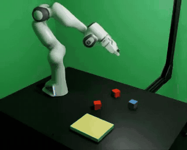

### 2 cubes — success

#### 2-cubes success 1

<video controls muted preload="metadata" width="640">
  <source src="assets/arena/2-cubes-success-01-external.mp4" type="video/mp4">
</video>

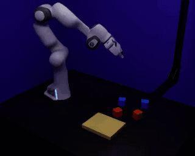

#### 2-cubes success 2

<video controls muted preload="metadata" width="640">
  <source src="assets/arena/2-cubes-success-02-external.mp4" type="video/mp4">
</video>

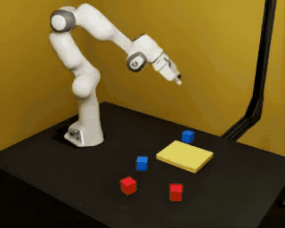

#### 2-cubes success 3

<video controls muted preload="metadata" width="640">
  <source src="assets/arena/2-cubes-success-03-external.mp4" type="video/mp4">
</video>

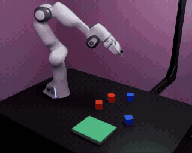

### 2 cubes — failure

#### 2-cubes failure 1

<video controls muted preload="metadata" width="640">
  <source src="assets/arena/2-cubes-failure-01-external.mp4" type="video/mp4">
</video>

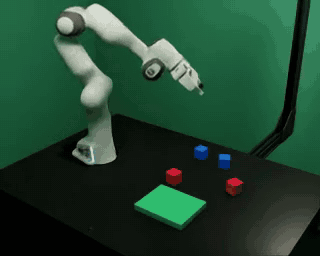

#### 2-cubes failure 2

<video controls muted preload="metadata" width="640">
  <source src="assets/arena/2-cubes-failure-02-external.mp4" type="video/mp4">
</video>

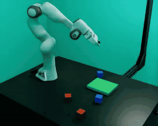

#### 2-cubes failure 3

<video controls muted preload="metadata" width="640">
  <source src="assets/arena/2-cubes-failure-03-external.mp4" type="video/mp4">
</video>

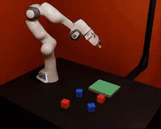

Serve the packaged result:

```bash
python3 -m http.server 8000 \
  --directory /workspace/IsaacLab-Scripts/franka_groot_e2e/assets/arena
```
