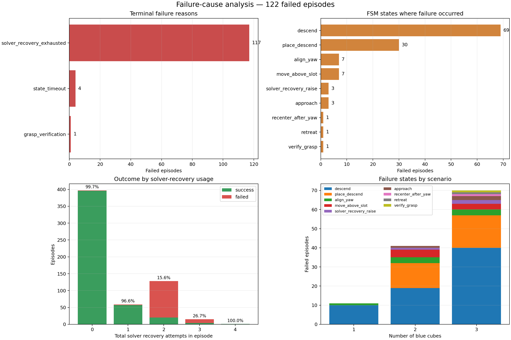

# Franka synthetic data → GR00T N1.7 → IsaacLab Arena

This directory is a shareable, end-to-end reference package for generating a
Franka blue-cube dataset in Isaac Lab, converting it to LeRobot v2.1,
fine-tuning GR00T N1.7, and evaluating the checkpoint in IsaacLab Arena. The
scripts use the two verified fork branches below; model weights and generated
datasets remain outside Git.

> **Asset refresh status:** the current assets preserve the last completed E2E
> run as a reference. Replace them with outputs from the new posture-recovery
> dataset, its SFT checkpoint, and its Arena evaluation before customer delivery.

## Package layout

```text
franka_groot_e2e/
├── README.md
├── scripts/
│   ├── 01_generate/     # Isaac Lab generation and trajectory analysis
│   ├── 02_convert/      # Isaac output → LeRobot v2.1
│   ├── 03_sft/          # 8-GPU GR00T SFT and attention visualization
│   └── 04_arena_eval/   # 8-GPU, 100-episode/task Arena evaluation
└── assets/
    ├── 01_generation/   # two real synthetic episodes
    ├── 02_analysis/     # trajectory, scenario, and failure graphs
    ├── 03_sft_attention/# four final-checkpoint attention maps
    └── 04_arena_eval/   # summary, HTML report, and success/failure videos
```

The bundled assets are compact evidence from completed runs, not mockups:

- generation samples and the first three analysis plots come from the
  480-attempt dataset used for the completed SFT run;
- `failure_analysis_latest_600eps.*` comes from the newer 600-attempt generator
  regression and is labeled separately because that dataset was not used for
  the archived checkpoint;
- attention maps come from `checkpoint-10000` for dataset episodes 0–3;
- Arena results come from 100 evaluation episodes for each of the 1-, 2-, and
  3-blue-cube tasks, using evaluation seeds outside the generation range.

## E2E stages

1. Install three isolated Python environments and download both public models.
2. Generate and analyze Isaac Lab episodes.
3. Convert successful episodes to LeRobot v2.1.
4. Fine-tune GR00T N1.7 on eight GPUs with W&B online logging.
5. Run 100 Arena episodes per task on eight GPUs and review the bundled report.

## Prepared paths

- Synthetic generator: `/workspace/IsaacLab-Scripts/franka_groot_e2e/scripts/01_generate/franka_lift_auto_parallel.py`
- Dataset converter: `/workspace/IsaacLab-Scripts/franka_groot_e2e/scripts/02_convert/convert_franka_to_groot_lerobot.py`
- Trajectory/scenario analyzer: `/workspace/IsaacLab-Scripts/franka_groot_e2e/scripts/01_generate/analyze_franka_trajectories.py`
- GR00T repository/venv: `/workspace/Isaac-GR00T`, `.venv`
- Arena repository/venv: `/workspace/IsaacLab-Arena`, `.venv`
- GR00T N1.7: `/workspace/models/GR00T-N1.7-3B`
- Cosmos Reason2: `/workspace/models/Cosmos-Reason2-2B`
- Hugging Face cache: `/workspace/models/huggingface-cache`

Both venv activation scripts include the local native libraries required by this container. The GR00T venv also sets `HF_HOME` and `GROOT_COSMOS_MODEL_PATH` when they are not already set.

## 0. Rebuild the Docker environments

Do not install the full workflow into one Python environment. The working
container uses three isolated Python 3.12 environments because the GR00T and
Isaac stacks require incompatible PyTorch and NumPy versions:

| environment | purpose | package stack |
| --- | --- | --- |
| `/workspace/env_isaaclab` | synthetic generation and trajectory analysis | pip, Isaac Sim 6.0.1.0, Isaac Lab 3.0.0b2.post1, Torch 2.11.0, NumPy 2.3.1 |
| `/workspace/Isaac-GR00T/.venv` | LeRobot conversion, training, and GR00T server | uv lock, Torch 2.9.0+cu128, NumPy 1.26.4, GR00T editable install |
| `/workspace/IsaacLab-Arena/.venv` | Arena evaluation clients | uv lock, Isaac Sim 6.0.0.1, Isaac Lab 3.0.0b2, Torch 2.11.0+cu128, NumPy 2.3.1 |

Clone the verified branches:

```bash
cd /workspace
git clone --branch jryu/franka-demo --single-branch \
  https://github.com/jihyeonRyu/Isaac-GR00T.git
git clone --branch jryu/franka-demo --single-branch \
  https://github.com/jihyeonRyu/IsaacLab-Arena.git
git clone --branch main --single-branch \
  https://github.com/jihyeonRyu/IsaacLab-Scripts.git
```

Verified revisions: GR00T `d6ee11a`, Arena `aba2e18`, and this E2E package from the Scripts `main` branch.

### 0.1 Install the uv bootstrap

`uv` itself was installed with pip into a small standalone venv. GR00T and
Arena are then resolved from their checked-in `uv.lock` files:

```bash
/usr/bin/python3 -m venv /workspace/.uv-bootstrap
/workspace/.uv-bootstrap/bin/python -m pip install --upgrade pip
/workspace/.uv-bootstrap/bin/python -m pip install uv==0.11.31
export UV=/workspace/.uv-bootstrap/bin/uv
```

### 0.2 Synthetic generation environment: pip install

This is the only main environment installed directly with pip. The Isaac Lab
extra pulls the matching Isaac Sim wheel set:

```bash
/usr/bin/python3 -m venv /workspace/env_isaaclab
source /workspace/env_isaaclab/bin/activate
python -m pip install --upgrade pip setuptools wheel
python -m pip install \
  --extra-index-url https://pypi.nvidia.com \
  "isaaclab[isaacsim,all]==3.0.0b2.post1"
export OMNI_KIT_ACCEPT_EULA=YES ACCEPT_EULA=Y
python -m pip check
```

Installed core versions:

```text
isaacsim               6.0.1.0
isaaclab               3.0.0b2.post1
torch/vision/audio     2.11.0 / 0.26.0 / 2.11.0
numpy                  2.3.1
opencv-python-headless 4.13.0.90
```

`IsaacLab-Scripts` is a script repository and needs no editable pip install.
Run its generator and analyzer with `/workspace/env_isaaclab/bin/python`.

### 0.3 GR00T conversion/training/server environment: uv sync

GR00T was installed from its lockfile, not dependency by dependency:

```bash
cd /workspace/Isaac-GR00T
/workspace/.uv-bootstrap/bin/uv sync --frozen --python 3.12
source .venv/bin/activate
/workspace/.uv-bootstrap/bin/uv pip check --python .venv/bin/python
```

Important resolved versions:

```text
gr00t                  0.1.0 (editable)
torch/torchvision      2.9.0+cu128 / 0.24.0+cu128
numpy/pandas           1.26.4 / 2.2.3
transformers           4.57.3
diffusers/peft         0.35.1 / 0.17.1
flash-attn/deepspeed   2.8.3 / 0.17.6
torchcodec/wandb       0.8.0 / 0.23.0
msgpack-numpy/pyzmq    0.4.8 / 27.0.1
```

`torchcodec==0.8.0` supports FFmpeg 4 through 7. This container installed its
local FFmpeg 7 runtime with:

```bash
/workspace/.tools/micromamba/bin/micromamba create \
  -p /workspace/.tools/ffmpeg-7 -c conda-forge "ffmpeg<8" -y
export LD_LIBRARY_PATH="/workspace/.tools/ffmpeg-7/lib${LD_LIBRARY_PATH:+:$LD_LIBRARY_PATH}"
```

For a clean rebuild, export these paths explicitly or put them in a wrapper
script rather than relying on generated activation-file edits:

```bash
export HF_HOME=/workspace/models/huggingface-cache
export GROOT_COSMOS_MODEL_PATH=/workspace/models/Cosmos-Reason2-2B
```

### 0.4 Download both local models

The `hf` CLI comes from the GR00T lock. Both model repositories are public, so no Hugging Face login or token is required:

```bash
cd /workspace/Isaac-GR00T
source .venv/bin/activate
mkdir -p /workspace/models/huggingface-cache
export HF_HOME=/workspace/models/huggingface-cache
hf download nvidia/GR00T-N1.7-3B \
  --local-dir /workspace/models/GR00T-N1.7-3B
hf download nvidia/Cosmos-Reason2-2B \
  --local-dir /workspace/models/Cosmos-Reason2-2B
```

Once downloaded, conversion, training, and evaluation use local model paths.

### 0.5 Arena evaluation environment: uv sync plus RPC packages

```bash
cd /workspace/IsaacLab-Arena
/workspace/.uv-bootstrap/bin/uv sync --frozen --python 3.12
source .venv/bin/activate
# Install these after uv sync for the GR00T ZeroMQ protocol.
python -m pip install msgpack-numpy==0.4.8 pyzmq==27.0.1
python -m pip check
export OMNI_KIT_ACCEPT_EULA=YES ACCEPT_EULA=Y
```

Arena's locked stack is Isaac Sim 6.0.0.1, Isaac Lab 3.0.0b2, Torch
2.11.0+cu128, and NumPy 2.3.1. Isaac/Kit also needs `libICE.so.6`,
`libSM.so.6`, and `libXt.so.6`:

```bash
apt-get update
apt-get install -y libice6 libsm6 libxt6t64
```

This rootless container extracted those libraries under a local prefix instead:

```bash
export LD_LIBRARY_PATH="/workspace/.tools/isaac-system-libs/usr/lib/x86_64-linux-gnu${LD_LIBRARY_PATH:+:$LD_LIBRARY_PATH}"
```

Run `uv sync` before the two manual RPC packages; a later sync can remove
packages that are not declared by the Arena lock.

## 1. Generate synthetic episodes

Run from the dedicated Isaac Lab generation venv. This command launches the current
600-episode refresh on eight GPUs while preserving the validated camera geometry.

```bash
cd /workspace/IsaacLab-Scripts
source /workspace/env_isaaclab/bin/activate

python /workspace/IsaacLab-Scripts/franka_groot_e2e/scripts/01_generate/franka_lift_auto_parallel.py \
  --headless \
  --enable_cameras \
  --num_envs 4 \
  --auto_generate_episodes 600 \
  --gpu_ids 0 1 2 3 4 5 6 7 \
  --asset_version_override 5.1 \
  --sensor_modalities rgb \
  --output_dir /workspace/output/franka_posture_recovery_rgbfull_600eps_seed50007_20260724 \
  --fps 15 \
  --width 320 \
  --height 256 \
  --no_realtime \
  --seed 50007
```

The automatic mode enables action/state logs, external and wrist RGB capture, and MP4 output. Successful episodes have `logs/result.json` with `completed=true` and `failed=false`.

Bundled successful external-camera examples from the training dataset:

| scenario | episode | video |
| --- | ---: | --- |
| one blue cube | 288 | [MP4](assets/01_generation/one_cube_success_episode_000288.mp4) |
| three blue cubes | 279 | [MP4](assets/01_generation/three_cubes_success_episode_000279.mp4) |

Current generation defaults:

- loose cube/tray workspace: X `0.33–0.70 m`, Y `-0.34–0.34 m`, maximum radius `0.68 m`;
- randomized start EEF: X `0.36–0.70 m`, Y `-0.34–0.34 m`, Z `0.25–0.55 m`, safe radius `0.40–0.72 m`;
- start-pose augmentation translates only and preserves the validated floor-facing tool orientation;
- tray side alternates by episode and cube sampling covers both lateral table halves;
- deliberate pre-grasp recovery occurs for 10% of targets, using a 4–8 cm lateral waypoint 12–18 cm above the cube;
- yaw alignment is followed by a 6 mm post-yaw recenter, and XY centering remains enforced while descending and closing;
- an IK stall while holding a cube raises vertically at fixed XY before retrying placement; an unladen stall uses safe raise, neutral recenter, and an optional restoration of the validated floor-facing tool quaternion;
- quaternion restoration follows the shortest arc while holding the neutral EEF position; after 480 control steps it continues with a logged partial recovery when the tool is already inside the validated floor-facing tilt limit, so an unreachable exact quaternion cannot create a new terminal failure;
- solver recovery allows up to 3 retries per cube before marking the episode failed;
- when domain randomization is enabled, each background RGB channel is sampled independently over the full `[0, 1]` range; task lighting remains near-neutral.

Vectorized generation samples loose objects against each environment slot's
actual fixed tray pose; it never shifts only the tray metadata after sampling.
The yaw-conservative object footprint is checked again after vector asset-size
adaptation, and generation fails fast if any initial object touches the tray.
This path was stress-tested with:

```bash
python franka_groot_e2e/scripts/01_generate/franka_lift_auto_parallel.py \
  --headless \
  --no-multi_gpu \
  --num_envs 4 \
  --validate_layouts_only 2000 \
  --seed 50007 \
  --asset_version_override 5.1
```

All 2,000 fixed-tray layouts passed with zero tray/object footprint overlaps;
the blue-cube counts stayed balanced at 680 one-cube, 644 two-cube, and 676
three-cube scenarios. A separate four-environment Isaac physics smoke test also
recorded zero initial footprint overlaps.
It completed 4/4 episodes and 8/8 pick-place operations without recovery exhaustion.

### Analyze trajectory coverage and scenario success

The analyzer reads the measured `ee_pos_env` from `logs/states.jsonl`; it does
not reconstruct motion by integrating commanded actions.

```bash
cd /workspace/IsaacLab-Scripts
source /workspace/env_isaaclab/bin/activate

python /workspace/IsaacLab-Scripts/franka_groot_e2e/scripts/01_generate/analyze_franka_trajectories.py \
  /workspace/output/franka_parallel_dataset \
  --output-dir /workspace/output/franka_parallel_dataset/trajectory_analysis
```

Outputs:

```text
trajectory_distribution.png
trajectory_by_blue_cube_count.png
scenario_statistics.png
failure_analysis.png
failure_analysis.json
episode_metrics.csv
scenario_success.csv
failure_causes.csv
solver_recovery_outcomes.csv
scenario_summary.json
```

The figures include X–Y, X–Z, Y–Z, and 3D measured EEF trajectories. Trajectories
are grouped by the number of blue cubes, with solid success and dashed failure
lines. The CSV/JSON files include episode counts, success/failure counts and rates,
frames, durations, measured path lengths, and X/Y/Z ranges and spans.
`failure_analysis.png` adds terminal failure reasons, failed FSM states,
success/failure by total solver-recovery use, and failed-state counts by blue-cube
scenario. The matching JSON/CSV files retain episode-level reasons and retry counts.

Bundled analysis figures:

<p>
  
  
</p>
<p>
  
  
</p>

The trajectory and scenario plots describe the 480-attempt training source.
The failure plot describes the newer 600-attempt run: 478 successes and 122
failures, including 117 `solver_recovery_exhausted` failures. Its exact counts
are in [failure_analysis_latest_600eps.json](assets/02_analysis/failure_analysis_latest_600eps.json).

## 2. Convert to LeRobot v2.1

```bash
cd /workspace/Isaac-GR00T
source .venv/bin/activate

python /workspace/IsaacLab-Scripts/franka_groot_e2e/scripts/02_convert/convert_franka_to_groot_lerobot.py \
  /workspace/output/franka_parallel_dataset \
  /workspace/datasets/franka_parallel_groot_lerobot
```

The converter:

- keeps successful episodes by default;
- aligns actions, states, and both videos by `sim_step`;
- converts XYZW quaternion state to the exact 6D rotation convention used by the Arena policy;
- writes `eef_pose(9) + gripper(1)` state and `eef_delta(6) + gripper(1)` action;
- validates FPS, resolution, MP4 frame counts, Parquet metadata, and normalization statistics;
- refuses to overwrite a non-empty output directory.

Use `--allow-incomplete` only when intentionally skipping malformed recordings. Use `--include-failed` only for diagnostics, not normal imitation learning.

### Current converted dataset specification

- Dataset: `/workspace/datasets/franka_parallel_groot_lerobot` (LeRobot v2.1)
- Episodes: 374
- Total frames: 208,268 at 15 FPS
- Cameras: `external` and `wrist`, RGB 320×256
- Image input: current frame only (`delta_indices=[0]`)
- Robot state: current absolute EEF XYZ + rotation 6D and gripper width (10D total)
- Action horizon: 40 frames, approximately 2.67 seconds at 15 FPS
- EEF action: stored delta XYZ + delta rotvec (6D)
- Gripper action: stored absolute `-1/1` command (1D)
- Language: `annotation.human.action.task_description`
- Normalization: 1st/99th-percentile min-max to `[-1, 1]`, with outlier clipping

The action training target is:

```text
action[t:t+40]
→ collect the stored delta EEF and absolute gripper values
→ q01/q99 percentile min-max normalization
→ diffusion action-head target
```

The completed 480-attempt dataset below predates the newly widened workspace and
post-yaw recenter defaults. Its generation completion and retained training data
by blue-cube count are:

| blue cubes | attempts | successful/retained episodes | generation success | retained frames |
| ---: | ---: | ---: | ---: | ---: |
| 1 | 161 | 161 | 100.00% | 53,562 |
| 2 | 164 | 117 | 71.34% | 70,894 |
| 3 | 155 | 96 | 61.94% | 83,812 |
| total | 480 | 374 | 77.92% | 208,268 |

These generation rates measure scripted data-generation completion. They are not
the trained policy's Arena evaluation success rates.

## 3. Fine-tune GR00T on 8 GPUs

Authenticate W&B once, then run the checked-in launcher. The Hugging Face models are
already stored locally, so training does not depend on an online model download.

```bash
cd /workspace/Isaac-GR00T
source .venv/bin/activate
wandb login

bash /workspace/IsaacLab-Scripts/franka_groot_e2e/scripts/03_sft/train_franka.sh
```

The current defaults are the reproducible full-run settings:

- 8 GPUs and global batch size 64;
- 10,000 optimizer steps, checkpoint every 250 steps;
- `crop_fraction=0.98` with shortest image edge 256;
- state dropout 0.20;
- brightness/contrast/saturation/hue jitter 0.25/0.25/0.30/0.03;
- W&B online project `franka-gr00t`;
- frozen visual-language reasoner (`TUNE_LLM=0`), with projector and diffusion head trained;
- four debug samples (episodes 0, 1, 2, and 3 at frame 120) at every saved checkpoint.

The completed run is:

```text
/workspace/Isaac-GR00T/outputs/franka-groot-sft/
  franka-blue-cube-sft-crop098-aug-v2/checkpoint-10000
```

Its W&B run is `iycwnbnb`. The final four local attention images are under:

```text
/workspace/Isaac-GR00T/outputs/attention/
  franka-blue-cube-sft-crop098-aug-v2/checkpoint-10000-ep{0,1,2,3}-step120.png
```

The reasoner attention panels use the dataset task prompt stored in LeRobot metadata.
They show Cosmos attention for that prompt and input image. With `TUNE_LLM=0`, raw
reasoner attention is expected to remain mostly fixed; action saliency can still change
because the projector and action head are trained.

Final checkpoint attention examples, all evaluated with the dataset task prompt:

<p>
  
  
</p>
<p>
  
  
</p>

For a short pipeline check, override `NUM_GPUS=1 GLOBAL_BATCH_SIZE=2 MAX_STEPS=2
SAVE_STEPS=2 DATALOADER_NUM_WORKERS=0 EXPERIMENT_NAME=franka-blue-cube-smoke`.

## 4. Evaluate the checkpoint in Arena on 8 GPUs

The parallel launcher starts one GR00T server per physical GPU and launches a fresh
Arena worker for each task stage on that GPU. Each process uses `cuda:0` inside its
own `CUDA_VISIBLE_DEVICES` namespace. Install the
small RPC dependencies in the Arena venv once if they are not already present:

```bash
cd /workspace/IsaacLab-Arena
source .venv/bin/activate
python -m pip install msgpack-numpy==0.4.8 pyzmq==27.0.1
```

Run the 100-episode-per-task evaluation (300 episodes total):

```bash
cd /workspace/IsaacLab-Arena
source .venv/bin/activate

python /workspace/IsaacLab-Scripts/franka_groot_e2e/scripts/04_arena_eval/parallel_evaluation.py \
  --checkpoint /workspace/Isaac-GR00T/outputs/franka-groot-sft/franka-blue-cube-sft-crop098-aug-v2/checkpoint-10000 \
  --num-gpus 8 \
  --episodes-per-task 100 \
  --base-port 5655 \
  --output-dir /workspace/IsaacLab-Arena/outputs/franka-gr00t-parallel/final-crop098-aug-v2-8gpu-renderfix-100eps
```

Port 5655 is used because another service may occupy the default port 5555. The
launcher checks all requested GPUs, model/config paths, and the complete port range
before starting any child process. It also supplies the local Cosmos path and required
Isaac Sim EULA environment variables.

Evaluation deliberately uses seeds distinct from data generation:

| task | base seed | rank seeds |
| --- | ---: | --- |
| one blue cube | 10007 | 10007–10014 |
| two blue cubes | 20007 | 20007–20014 |
| three blue cubes | 30007 | 30007–30014 |

The 100 episodes for each task are split across the eight workers as
`[13, 13, 13, 13, 12, 12, 12, 12]`. Every worker runs one Arena environment, which avoids
multiplying the policy server batch unexpectedly. Recorder HDF5 datasets are written
inside each run output directory with a rebuild-specific filename, so concurrent
workers never contend for `/tmp/isaaclab/logs`.

Each task starts in a new Isaac Sim process, and the launcher passes synchronous RTX
geometry-loading arguments. This avoids stale Fabric/RTX transforms after stage
rebuilds. The completed Arena evaluation below matches the archived training data
distribution by using fixed 5 cm cubes and the former generator maximum X of
0.62 m. A checkpoint trained on newly generated data must evaluate with the new
X/Y/radius bounds above instead.

Camera visualization is enabled by default. The launcher records external and wrist
MP4s, keeps per-rank HTML reports and logs, and writes these aggregate outputs:

```text
<output-dir>/parallel_eval_manifest.json
<output-dir>/summary.json
<output-dir>/index.html
<output-dir>/logs/server-rank-*.log
<output-dir>/logs/arena-<task>-rank-*.log
<output-dir>/rank-*/stage-<task>/...
```

Use `--no-record-camera-video` only for a deliberately faster non-visual evaluation.
The renderer is Isaac Sim's `IsaacRtxRenderer` real-time RTX backend; this workflow
does not enable path tracing.

Final trained-policy success by blue-cube count:

| blue cubes | evaluation episodes | successes | Arena success rate |
| ---: | ---: | ---: | ---: |
| 1 | 100 | 94 | 94% |
| 2 | 100 | 41 | 41% |
| 3 | 100 | 29 | 29% |
| total | 300 | 164 | 54.67% |

Bundled external-camera examples are matched directly to their
`episode_results_rebuild0.jsonl` records:

| Arena task | successful episode | failed episode |
| --- | --- | --- |
| one blue cube | [seed 10007, episode 0](assets/04_arena_eval/videos/one_cube_success.mp4) | [seed 10008, episode 1](assets/04_arena_eval/videos/one_cube_failure.mp4) |
| two blue cubes | [seed 20007, episode 0](assets/04_arena_eval/videos/two_cubes_success.mp4) | [seed 20007, episode 1](assets/04_arena_eval/videos/two_cubes_failure.mp4) |
| three blue cubes | [seed 30007, episode 1](assets/04_arena_eval/videos/three_cubes_success.mp4) | [seed 30007, episode 0](assets/04_arena_eval/videos/three_cubes_failure.mp4) |

The archived machine-readable results are
[summary.json](assets/04_arena_eval/summary.json) and
[parallel_eval_manifest.json](assets/04_arena_eval/parallel_eval_manifest.json).
Open [the bundled Arena HTML report](assets/04_arena_eval/index.html) for the
full per-rank browser view.

The checkpoint predicts a 40-action horizon. Arena executes the first 16 actions
(`action_chunk_length=16`) before requesting a new chunk.

## Verified in this container

- 480 generated attempts produced 374 valid LeRobot v2.1 episodes and 208,268 frames at 15 FPS.
- The trajectory analyzer reproduced the generator outcomes by cube count: 161/161 for one cube, 117/164 for two cubes, and 96/155 for three cubes.
- Final widened-workspace/post-yaw regression: 4/4 three-cube episodes and 12/12 centered grasps at true 15 FPS.
- The converted dataset has external/wrist RGB `(256, 320, 3)`, EEF pose state 9D plus gripper 1D, and EEF delta action 6D plus gripper 1D.
- GR00T N1.7 and Cosmos Reason2 load from `/workspace/models` without a runtime Hugging Face download.
- The 8-GPU training run reached step 10,000 and wrote a complete `checkpoint-10000`.
- Four checkpoint-10,000 attention/debug images were produced for episodes 0–3.
- Arena cameras match generation at 15 FPS and 320×256 for both external and wrist views.
- A three-task render smoke test verified intact Franka geometry with a fresh Arena process per task.
- The final 8-GPU evaluation completed 100 episodes per task: 94% for one cube, 41% for two cubes, and 29% for three cubes.
